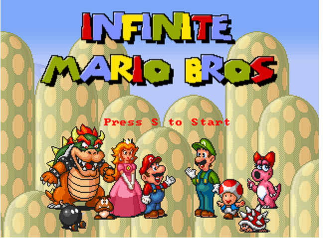
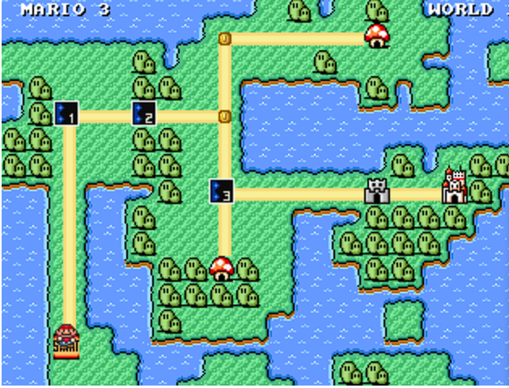
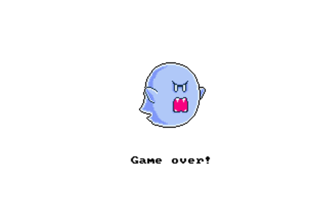

# Rapport Docker - Super Mario

## 1. Ouverture de Docker Desktop
- **Menu Images** : Vérification de l'absence initiale de l'image
- **Terminal intégré** : Accessible via l'icône terminal en bas à gauche

## 2. Récupération de l'image
```bash
docker pull pengbai/docker-supermario
```
**Observation Docker Desktop** :
- Apparition dans la liste des images
- Taille : 646MB
- Tag : latest
- Image ID : 077ed8c9236a

## 3. Lancement des containers
### Méthode 1 : Terminal interactif
```bash
docker run -it -p 8600:8080 pengbai/docker-supermario
```
**Comportement** :
- Affichage des logs en direct
- Blocage du terminal jusqu'à CTRL+C

### Méthode 2 : Interface Graphique
1. Cliquer "+" dans l'onglet Containers
2. Paramètres :
   - Image : pengbai/docker-supermario
   - Ports : 8700:8080
   - Nom : mario-gui

## 4. Accès au jeu
- **URL** : `http://localhost:8600`
- **Captures requises** :
  1. Écran titre 
  2. Niveau 1-1 
  3. Game Over 

## 5. Gestion des containers
### Trouver l'ID (2 méthodes)
1. CLI : `docker ps -a` → Colonne CONTAINER ID
2. GUI : Onglet Containers → Colonne ID

### Arrêt du container
```bash
docker stop f96031b83530  # Par ID
docker stop mario-container  # Par nom
```
**Observation** : Statut passe de "Running" à "Exited"

### Suppression (2 méthodes)
1. CLI : `docker rm f96031b83530`
2. GUI : Coche container → Poubelle
**Observation** : Disparition de la liste

## 6. Nettoyage de l'image
### Méthode CLI
```bash
docker rmi 077ed8c9236a
```
### Méthode GUI
1. Onglet Images
2. Coche pengbai/docker-supermario
3. Poubelle

**Vérification finale** : L'image disparaît des listes CLI/GUI

## Annexes
- **Schéma architecture** :
```
[Client] ↔ (Port 8600) ↔ [Container] ↔ (Port 8080) ↔ [Jeux]
```
- **Commandes utiles** :
  - `docker logs mario-container` : Voir les logs historiques
  - `docker stats` : Monitoring des ressources
